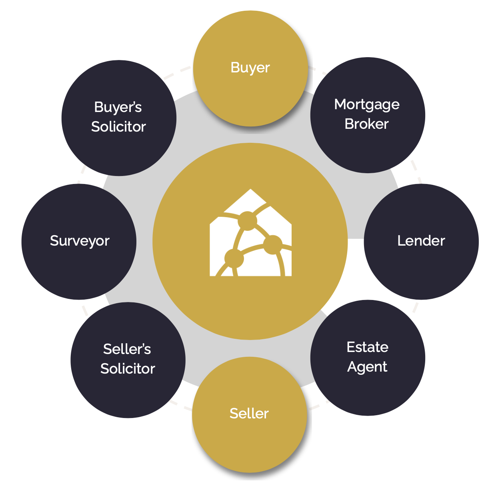

import { Image } from 'astro:assets';
import opdaLogo from '../../../assets/opda_logo_cropped.png';

<Image src={opdaLogo} alt="OPDA logo" width="64"/>

There have been several attempts to use technology to improve the poor consumer experience of buying and selling residential property in the UK. The reasons these have not been successful are varied, but commonly they have sought to create a new single, proprietary digital platform on which all transactions must be conducted. Due to the highly fragmented nature of the industry, it has not yet been possible to secure sufficient adoption for market dynamics to encourage all stakeholders to participate.

In setting out the Property Data Trust Framework (PDTF), we seek to propose a set of data, interface and governance principles that put the consumer (buyer and seller) at the heart of the process and allow participants to share data and coordinate transactions in a platform- and technology-agnostic manner. We believe this openness and transparency will provide the right conditions for broad industry adoption.

This document is designed to outline the framework and how it will evolve, to identify the roles and responsibilities of the various participants and to outline the technical principles that framework implementations should follow.

### Purpose

The Property Data Trust Framework will enable people and organisations to use and reuse information relating to a property. It will give them a way to access and share verified property information or “property attributes” with other people and organisations more easily.

The trust framework is a set of data standards, technical standards, and process rules that different organisations agree to follow to deliver one or more of their services. This includes legislation, standards, guidance, and the rules.

By adopting these standards, all services and organisations using the trust framework can describe property information they’ve created in a consistent way. This will make it easier for organisations and users to complete property transactions or share information with other trust framework participants.

### Principles

The aim is to create a framework that is:

- Consumer-centric - ensuring the property owner is in control of their data but also allowing for open accessibility and transparency where they permit it.
- Built on open standards - to minimise the effort and cost required for participants to implement framework-compliant software and tools.
- Trusted - providing visibility of the provenance of data, its history over time, and assurance it has not been tampered with.
- Extensible - to ensure that it is straightforward to evolve the standards to cover a wider range of conveyancing and, more generally, property data use cases.

### Framework Scope

The implementation of the PDTF development process is split into two parts:

1. Governance, roles and technical principles, which provide the requirements and context for framework implementation, and
2. An ongoing ‘proof-of-concept’ technical implementation of the framework, which does not seek to mandate technologies within the framework but which might serve to assist participants joining with a baseline, reference implementation.

This document relates only to the first of these parts.

The initial use case of the framework is to provide interoperability around the Home Buying and Selling Group’s ‘Property Pack’ concept, which incorporates the existing Buyers and Sellers Property Information (BASPI) dataset as well as Title Deed, Energy Performance Certificate and Property Searches data.

It is the intention of the framework that residential property transactions across the UK should be supported. However in this early phase the schemas are limited to the data requirements of transactions in England and Wales.

## Governance

It is recognised that framework governance will play an important role as the ecosystem of participants grows. At this early stage, we identify that concerted effort will need to be made to develop governance principles around:

- Framework design and documentation
- Participant requirements and certification
- Evolution of technical standards

## Participant Roles and Responsibilities

The framework aims to support all the various stakeholders in the process, the roles in the process can be defined at a high level in four key categories (shown above):

1. Data Consumers, comprising consumers (as in buyers and sellers), estate agents, conveyancers, mortgage brokers and lenders, surveyors etc.
2. Software Providers, who provide access points for data consumers to interact with the appropriate property data.
3. Data Providers, like HM Land Registry, property search data providers, local authorities etc, who are the top-level source of the required data.
4. Orchestration Service Providers, providing infrastructure and network services to allow participants to safely and securely collaborate.

### Responsibilities of Data Providers

Data providers are expected to:

- Implement server-side support for the Schema and API to make compliant data accessed by other participants.
- Establish relationships with orchestration service providers and software providers to mechanise the pull or push of data as needs dictate.
- Correctly generate provenance metadata to allow others to assess the reliability of the underlying data.

### Responsibilities of Software Providers

- Implement client- and, optionally, server-side support for the Schema and API to allow data to be read and written by other participants.
- Provide UI for consumers to view/visualise data and provenance, and submit data where their verified role allows.
- Securely manage users and correctly assign roles, thereby enforcing restrictions on access to create and read data.
- Correctly handle provenance metadata to allow others to visualise and assess the reliability of the underlying data.

### Responsibilities of Orchestration Service Providers

- Provide of “pipes” or infrastructure to securely share data between participants.
- Facilitate auditable transaction histories to underpin reliability of data.
- Facilitate creation of single source of trust - a Golden Record
- Securely manage participants and their users across their orchestrated networks, thereby enforcing restrictions on access to create and read data.

## Technical Principles

### Overview

The Framework combines:

- a set of data schemas which provide a common vocabulary for data exchange, and
- a standard API, which allows software developers to implement support across all data and orchestration service providers with minimal implementation effort.

In accordance with our goal of making implementation of the Framework as straightforward as possible, the following Open Standards are employed:

- JSON Schema https://json-schema.org
- Open API Specification https://www.openapis.org
- OpenID Connect https://openid.net/connect/
- RESTful API Principles https://en.wikipedia.org/wiki/Representational_state_transfer
- Semantic Versioning https://semver.org
- Unique Property Reference Number (UPRN) https://www.geoplace.co.uk/addresses-streets/location-data/the-uprn

A key principle of the framework is that both the history and the provenance of the data is represented. To achieve this, it is necessary to prevent direct changes to the data itself, but instead store the changes as a series of ‘claims’, with associated provenance data.

To generate the current state of the data, it is necessary to successively apply the changes made in each claim to an initial blank data object. In this way a claim made against a particular part of the data structure can be replaced by later data, but the history and the provenance of each claim can always be available.

### Data Schemas

#### Schema Design and Decomposition

The Framework uses a number of interdependent JSON Schemas to represent the full range of property data. A root schema represents the overall Property Pack, with subschemas for individual pack elements being referenced from there.

This decomposition also allows for independent modelling of data which persists across property transactions (the Energy Performance Certificate, for example) as well as the more transient aspects of the sale itself.

A publicly-accessible Git repository for these schemas is at https://github.com/Property-Data-Trust-Framework/schemas.

#### Versioning

Well-managed versioning of framework schemas is very important, both in the early stages of framework development when there are likely to be many changes, but also when it has been more widely adopted, at which point there will be numerous software and services providers relying on consistent behaviour.

Framework schemas are labelled using Semantic Versioning as Major.Minor.Patch (e.g. “1.3.5”) where it is clear whether changes are backwards-compatible bug fixes (Patch increment), backwards-compatible but with new functionality (Minor increment), or a non backwards-compatible, breaking change (Major increment).

With care, it should be possible to significantly evolve the capabilities of the framework while still maintaining backward compatibility with earlier schema versions. In particular, it should rarely be necessary to add in additional ‘required’ properties to top-level elements which might invalidate existing data.

Data provided using older schemas will still be valid against newer ones (from the same Major version) and older software can silently ignore the new data until they’re ready to make use of it.

#### Representing Data Provenance

One of the key elements of the Framework is the requirement to attach provenance information to each element of property data.

The [OpenID Connect ‘verified claims’ model](https://openid.net/specs/openid-connect-4-identity-assurance-1_0.html) is used, which not only provides a standards-based way to represent the accompanying evidence, but also provides a way of representing elements like verified identities in a way which is already supported by identity service providers and recognised by relying parties.

The Framework extends the ‘claims’ object of the verified claims model with a PDTF Claims Schema, allowing for the representation of important schema version, data path information (where in the model does the supplied data belong) and attribution/licensing information.
Within the verified claims model, the following are additional requirements for PDTF claims:

- the trust_framework element must be set to “uk_pdtf”,
- the (normally optional) time element must be set to the date-time of the claim’s creation in ISO8601 format
- at least one evidence array element of the verification object must be present

#### Levels of provenance evidence

The ‘evidence’ element of the verified claims schema supports the representation of varying levels of provenance evidence:

- Vouch - where we rely on the attestation of an individual (normally the property owner)
- Document - where the attestation is supported by paper evidence that is digitised and attached (and which therefore requires manual examination to validate)
- Electronic Record - where the data has been retrieved from an electronic source (typically an online service, and usually requiring manipulation to validate against the schema) but which cannot be directly verified against that source for technical or commercial reasons
- Digitally Verified - an electronic record or document where it is possible at any time to electronically verify that the data supplied is the same as the original source data.

Any valid evidence element is permitted, and it is up to the business logic of the participants to determine whether the evidence is sufficiently strong to meet users’ requirements. For example, it may be acceptable that the property seller vouches for the state of the solar panels on their roof, but that the Title Deeds must come in electronic form directly from HM Land Registry.

### PDTF API Standard

#### API Design

The API is specified using the OpenAPI Standard and in accordance with REST-ful principles.
Mutability of the property data, or of historical claims, is not permitted; claims can only be added and the resulting property data state queried.

#### Claim schema

OpenID Connect is primarily intended for claims about identity. As such, the data model within the claims object itself does not support the metadata necessary to identify the schema, path and attribution aspect of exchanging property data.

A PTDF-claim JSON Schema is supplied, against which claims embedded in the OpenID Connect verified claims object should be valid.

#### Identifying a Property

For the vast majority of use cases it is sufficient to reference a property using its Unique Property Reference Number (UPRN), a unique identifier for every addressable location in Great Britain. The current schemas and API specification use UPRN as a natural primary key to identify both the property and the residential transaction.

However it is also possible that what a user considers to be a ‘property’ may comprise more than one UPRN, and that a residential sale may comprise the transfer of one or more Title Deeds that don’t directly correspond to a single UPRN.

It is envisaged that support for composite primary keys of UPRNs and Title Numbers will be added in the near future.

#### Supported Endpoints

In accordance with the restrictions on mutability of claims, the following endpoints are represented in the API Specification:

- (POST) Add Claim - supplying a verified claims object (comprising either a single verified claim or an array of them) which is added to the list of claims for a given UPRN.
- (GET) Claims - returning an array of verified claims for a given UPRN in chronological order of submission.
- (GET) Current State - returning the JSON representation of the current state of the property data for a given UPRN. This output is likely to be all that most participants will require if they don’t need to represent the provenance of the data to their users.
- (GET) Provenance Map - returning a JSON representation of the structure of the current state for a given UPRN but with Claims replacing the data. This output makes it straightforward to access provenance alongside the data when it's displayed.
- (POST) Subscribe - supplying a Callback URL to which newly submitted claims for a given UPRN should be POSTED. Servers should ensure timely event updates and make limited attempts at retries if the callback URL does not respond.
- (DELETE) Subscribe - cancel the claim callback subscription for the given UPRN for this account.

It should be possible to recreate both the current state and the provenance map given just the set of claims, but these endpoints are supported for convenience anyway.
Security

The PDTF Open API specification does not currently mandate security methods.
However it is likely that the specification, or the framework governance model, may require:

- use of HTTPS as a transport mechanism.
- use of OAuth or access token security where data is being written or where necessary to satisfy commercial constraints.
- more tightly-specified verified claims requirements to make it easier for end-users to understand whether to trust the sources and intermediaries of data.
- encryption-at-rest where sensitivity of data requires it.

#### Versioning

The PDTF API is also versioned using Semantic Versioning. It is intended that future changes be made through extension of the existing specification, to retain backward compatibility with earlier versions. Over time, legacy versions may become deprecated but capabilities will only be removed when participants have had plenty of time to migrate their implementations.

A publicly-accessible Git repository for the API Specifications is at https://github.com/Property-Data-Trust-Framework/api.
